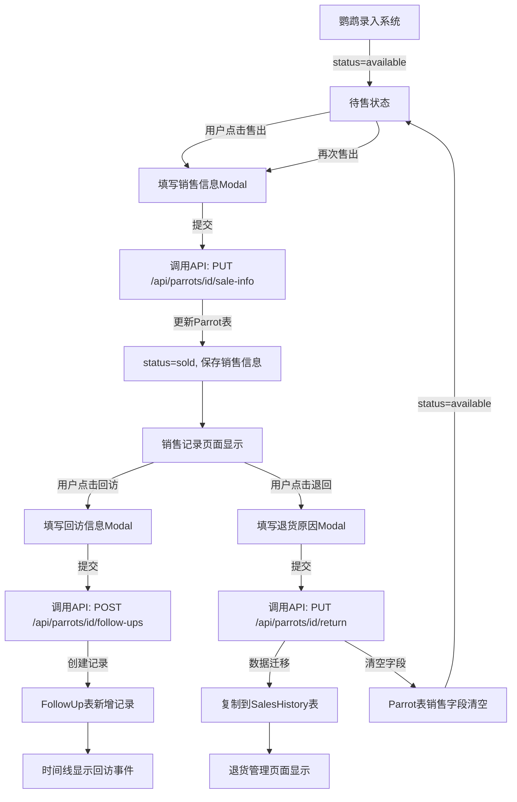
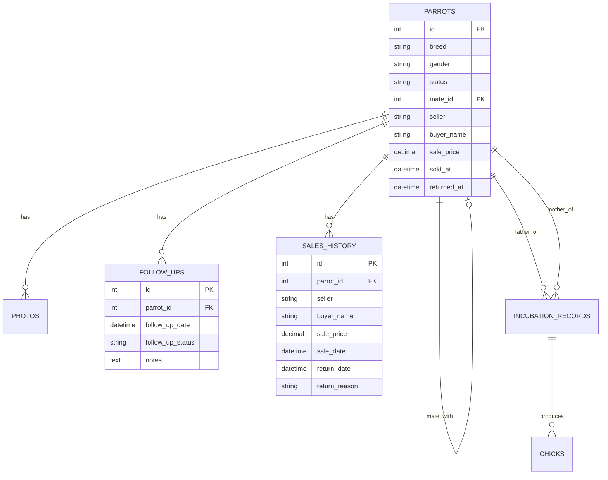
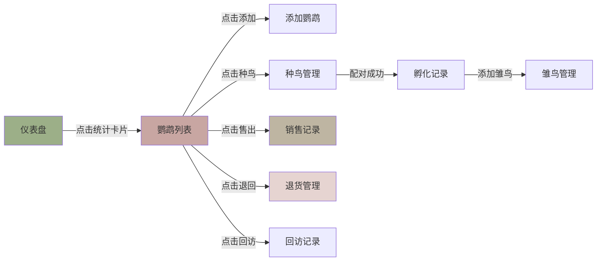
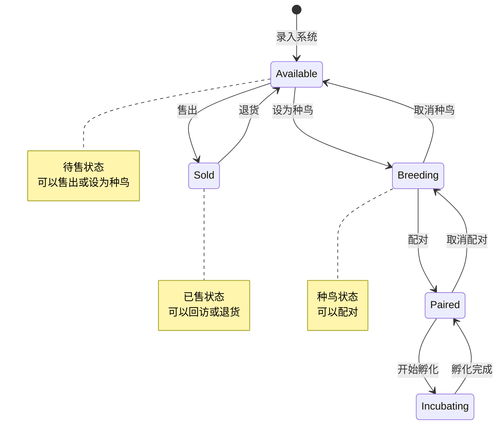
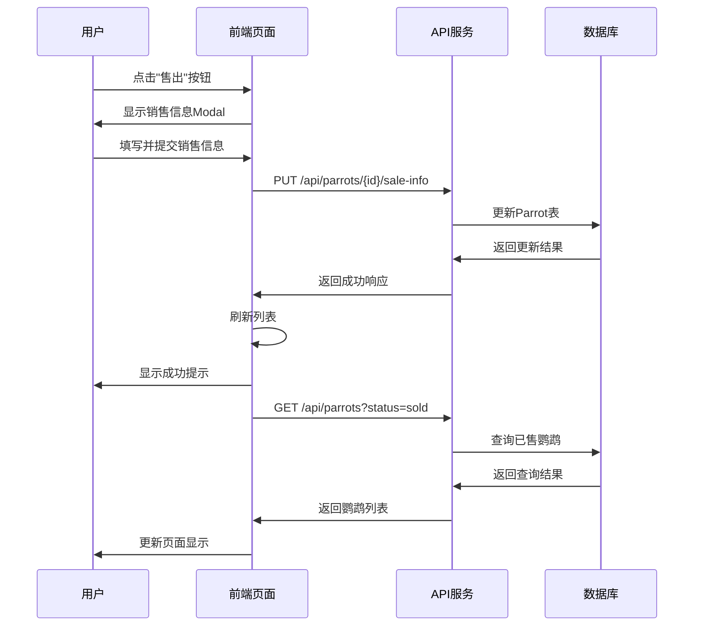
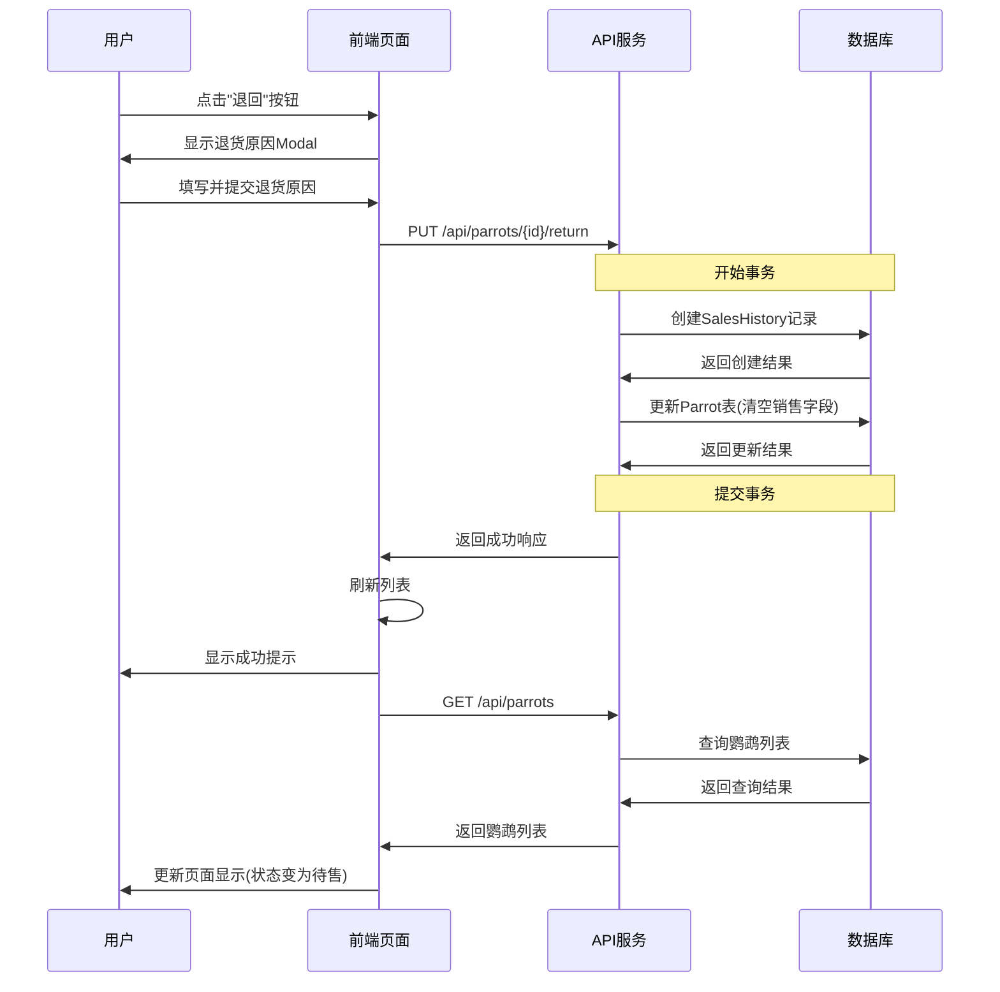
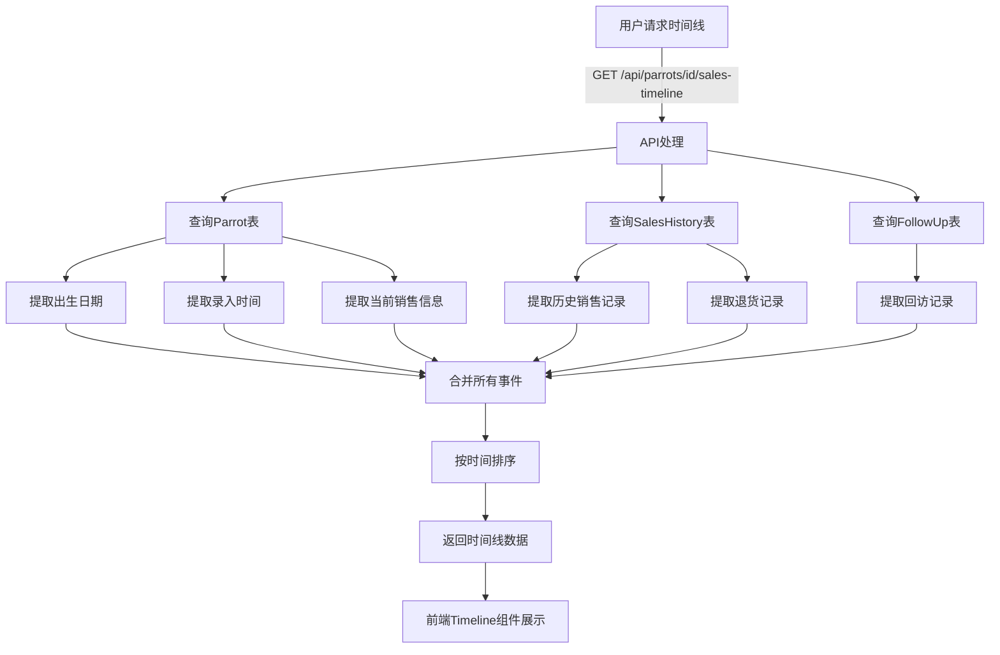

# 鹦鹉管理系统 - 数据流程图

## 1. 销售与退货完整流程图

```mermaid
graph TD
    A[鹦鹉录入系统] -->|status=available| B[待售状态]
    B -->|用户点击售出| C[填写销售信息Modal]
    C -->|提交| D[调用API: PUT /api/parrots/id/sale-info]
    D -->|更新Parrot表| E[status=sold, 保存销售信息]
    E --> F[销售记录页面显示]

    F -->|用户点击回访| G[填写回访信息Modal]
    G -->|提交| H[调用API: POST /api/parrots/id/follow-ups]
    H -->|创建记录| I[FollowUp表新增记录]
    I --> J[时间线显示回访事件]

    F -->|用户点击退回| K[填写退货原因Modal]
    K -->|提交| L[调用API: PUT /api/parrots/id/return]
    L -->|数据迁移| M[复制到SalesHistory表]
    L -->|清空字段| N[Parrot表销售字段清空]
    N -->|status=available| B
    M --> O[退货管理页面显示]

    B -->|再次售出| C
```

## 2. 数据表关系图

```mermaid
erDiagram
    PARROTS ||--o{ PHOTOS : has
    PARROTS ||--o{ FOLLOW_UPS : has
    PARROTS ||--o{ SALES_HISTORY : has
    PARROTS ||--o| PARROTS : mate_with
    PARROTS ||--o{ INCUBATION_RECORDS : father_of
    PARROTS ||--o{ INCUBATION_RECORDS : mother_of
    INCUBATION_RECORDS ||--o{ CHICKS : produces

    PARROTS {
        int id PK
        string breed
        string gender
        string status
        int mate_id FK
        string seller
        string buyer_name
        decimal sale_price
        datetime sold_at
        datetime returned_at
    }

    SALES_HISTORY {
        int id PK
        int parrot_id FK
        string seller
        string buyer_name
        decimal sale_price
        datetime sale_date
        datetime return_date
        string return_reason
    }

    FOLLOW_UPS {
        int id PK
        int parrot_id FK
        datetime follow_up_date
        string follow_up_status
        text notes
    }
```

## 3. 页面导航流程图

```mermaid
graph LR
    A[仪表盘] -->|点击统计卡片| B[鹦鹉列表]
    B -->|点击添加| C[添加鹦鹉]
    B -->|点击种鸟| D[种鸟管理]
    D -->|配对成功| E[孵化记录]
    E -->|添加雏鸟| F[雏鸟管理]
    B -->|点击售出| G[销售记录]
    B -->|点击退回| H[退货管理]
    B -->|点击回访| I[回访记录]

    style A fill:#9CAF88
    style B fill:#C8A6A2
    style G fill:#BEB5A2
    style H fill:#E6D4D1
```

## 4. 鹦鹉状态转换图

```mermaid
stateDiagram-v2
    [*] --> Available: 录入系统
    Available --> Breeding: 设为种鸟
    Breeding --> Available: 取消种鸟
    Available --> Sold: 售出
    Sold --> Available: 退货
    Breeding --> Paired: 配对
    Paired --> Breeding: 取消配对
    Paired --> Incubating: 开始孵化
    Incubating --> Paired: 孵化完成

    note right of Available
        待售状态
        可以售出或设为种鸟
    end note

    note right of Sold
        已售状态
        可以回访或退货
    end note

    note right of Breeding
        种鸟状态
        可以配对
    end note
```

## 5. API 调用时序图 - 售出流程

```mermaid
sequenceDiagram
    participant U as 用户
    participant F as 前端页面
    participant A as API服务
    participant D as 数据库

    U->>F: 点击"售出"按钮
    F->>U: 显示销售信息Modal
    U->>F: 填写并提交销售信息
    F->>A: PUT /api/parrots/{id}/sale-info
    A->>D: 更新Parrot表
    D->>A: 返回更新结果
    A->>F: 返回成功响应
    F->>F: 刷新列表
    F->>U: 显示成功提示
    F->>A: GET /api/parrots?status=sold
    A->>D: 查询已售鹦鹉
    D->>A: 返回查询结果
    A->>F: 返回鹦鹉列表
    F->>U: 更新页面显示
```

## 6. API 调用时序图 - 退货流程

```mermaid
sequenceDiagram
    participant U as 用户
    participant F as 前端页面
    participant A as API服务
    participant D as 数据库

    U->>F: 点击"退回"按钮
    F->>U: 显示退货原因Modal
    U->>F: 填写并提交退货原因
    F->>A: PUT /api/parrots/{id}/return

    Note over A,D: 开始事务
    A->>D: 创建SalesHistory记录
    D->>A: 返回创建结果
    A->>D: 更新Parrot表(清空销售字段)
    D->>A: 返回更新结果
    Note over A,D: 提交事务

    A->>F: 返回成功响应
    F->>F: 刷新列表
    F->>U: 显示成功提示
    F->>A: GET /api/parrots
    A->>D: 查询鹦鹉列表
    D->>A: 返回查询结果
    A->>F: 返回鹦鹉列表
    F->>U: 更新页面显示(状态变为待售)
```

## 7. 时间线数据整合流程

```mermaid
graph TD
    A[用户请求时间线] -->|GET /api/parrots/id/sales-timeline| B[API处理]
    B --> C[查询Parrot表]
    B --> D[查询SalesHistory表]
    B --> E[查询FollowUp表]

    C --> F[提取出生日期]
    C --> G[提取录入时间]
    C --> H[提取当前销售信息]

    D --> I[提取历史销售记录]
    D --> J[提取退货记录]

    E --> K[提取回访记录]

    F --> L[合并所有事件]
    G --> L
    H --> L
    I --> L
    J --> L
    K --> L

    L --> M[按时间排序]
    M --> N[返回时间线数据]
    N --> O[前端Timeline组件展示]
```
